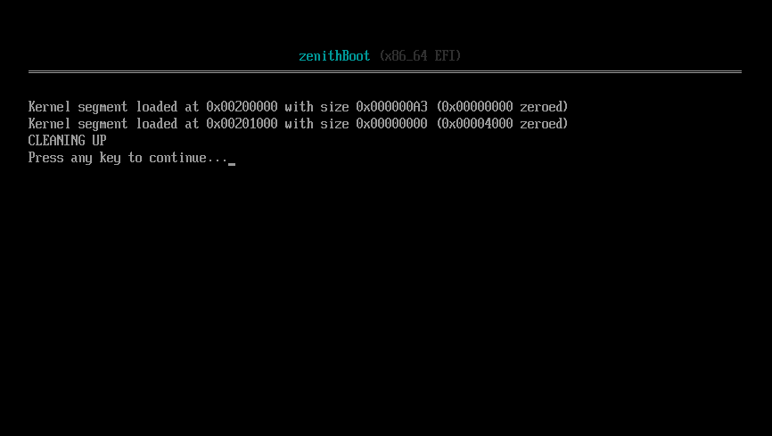

# ZenithBoot (for x86-64 EFI)

A minimal bootloader made for the **Zenith Boot Protocol**, used by **zenithOS**. It is built using GNU-EFI and targets x86-64 UEFI systems.

(Screenshot of zenithBoot)

> **Warning**: ZenithBoot is far from done and is missing a lot of features as it is still in heavy development.
